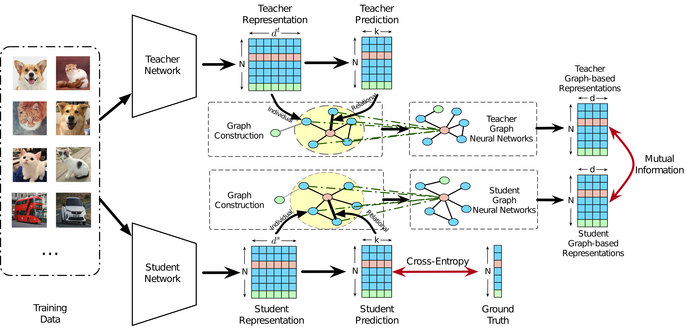
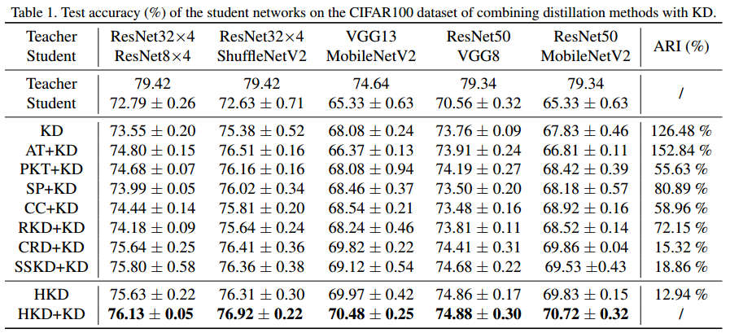

# HKD


Code for ICCV 2021 paper "Distilling Holistic Knowledge with Graph Neural Networks"

https://arxiv.org/abs/2108.05507



### cifia-100 result



The implementation of compared methods are based on the author-provided code and a open-source benchmark https://github.com/HobbitLong/RepDistiller.

## GK-DFD extension

This repository also implements the method from "Learning Graph Knowledge for
Discriminative Feature Distillation":

- class-balanced batches (`8` classes x `8` samples by default)
- Unified Edge Metric and Class-Aware Connections
- shared-topology graph consistency
- teacher-centered PCA and discriminative local alignment
- intra-class compactness and inter-class separation

The paper's public repository does not currently contain training code. This
implementation follows Algorithm 1: teacher logits and labels define one
shared topology for both branches, and the signed local alignment matrix is used
to compute a detached feature-coordinate eigenspace for DFD.

## Installation
```
conda install --yes --file requirements.txt
```

## Running

1. Fetch the pretrained teacher models by:

    ```
    sh scripts/fetch_pretrained_teachers.sh
    ```
   which will download and save the models to `save/models`

2. Run distillation by commands in `scripts\run_cifar_distill.sh`. An example of running HKD is given by:

    ```
    python train_student.py --path_t ./save/models/resnet32x4_vanilla/ckpt_epoch_240.pth --distill hkd --model_s resnet8x4 -a 1 -b 3 --mode hkd --trial 1
    ```

   Run GK-DFD with the paper defaults:

    ```
    python train_student.py --path_t ./save/models/resnet32x4_vanilla/ckpt_epoch_240.pth --distill gkdfd --model_s resnet8x4 --batch_size 64 --trial 1
    ```

   For GK-DFD, the default batch is eight classes with eight samples each;
   `--gkdfd_k1 7` selects all same-class neighbours and
   `--gkdfd_k2 56` selects the available inter-class neighbours. `-a` weights
   graph consistency (default `0.7`) and `-b` weights discriminative feature
   distillation (default `1.2`). The optional `--gkdfd_kd_weight` adds
   conventional logit KL distillation; it defaults to `0` to match the loss
   stated in the paper.

## Citation

```
@InProceedings{Zhou_2021_ICCV,
    author    = {Zhou, Sheng and Wang, Yucheng and Chen, Defang and Chen, Jiawei and Wang, Xin and Wang, Can and Bu, Jiajun},
    title     = {Distilling Holistic Knowledge With Graph Neural Networks},
    booktitle = {Proceedings of the IEEE/CVF International Conference on Computer Vision (ICCV)},
    month     = {October},
    year      = {2021},
    pages     = {10387-10396}
}
```
